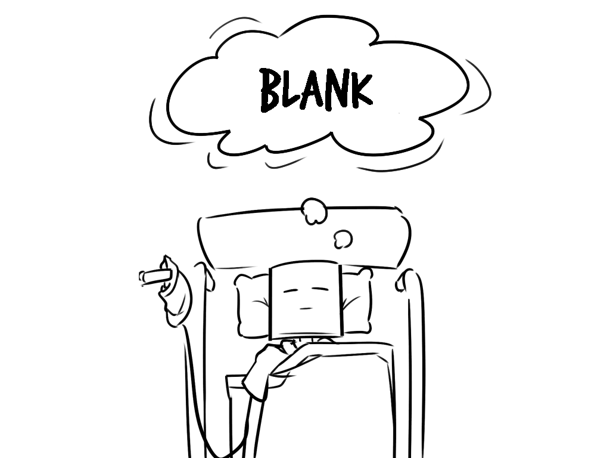
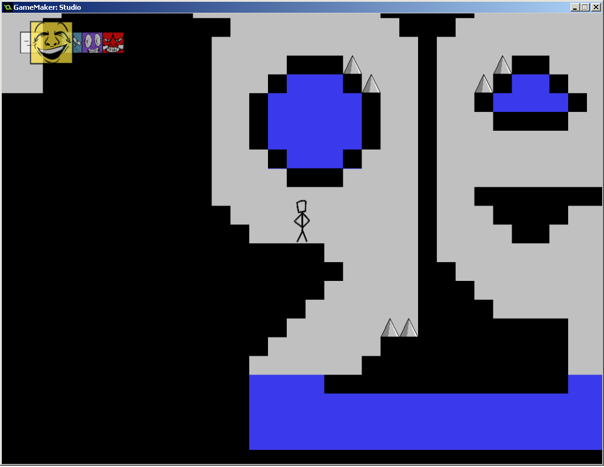
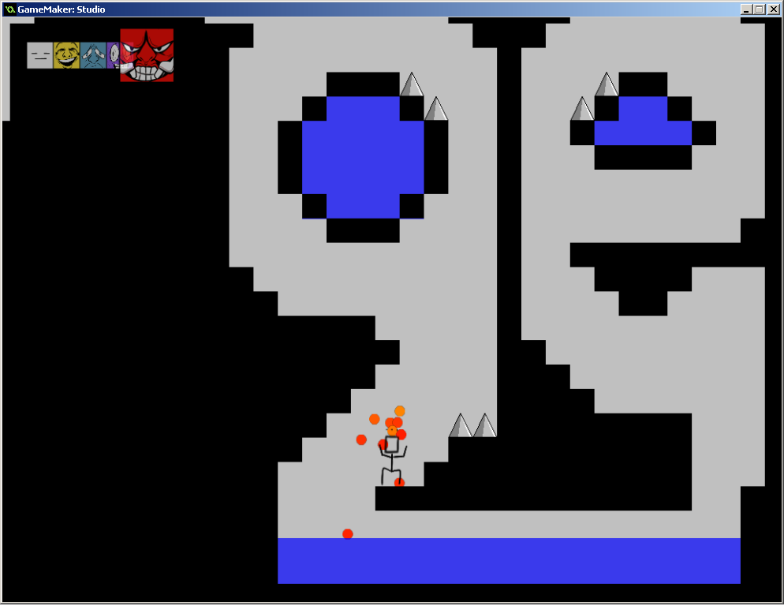
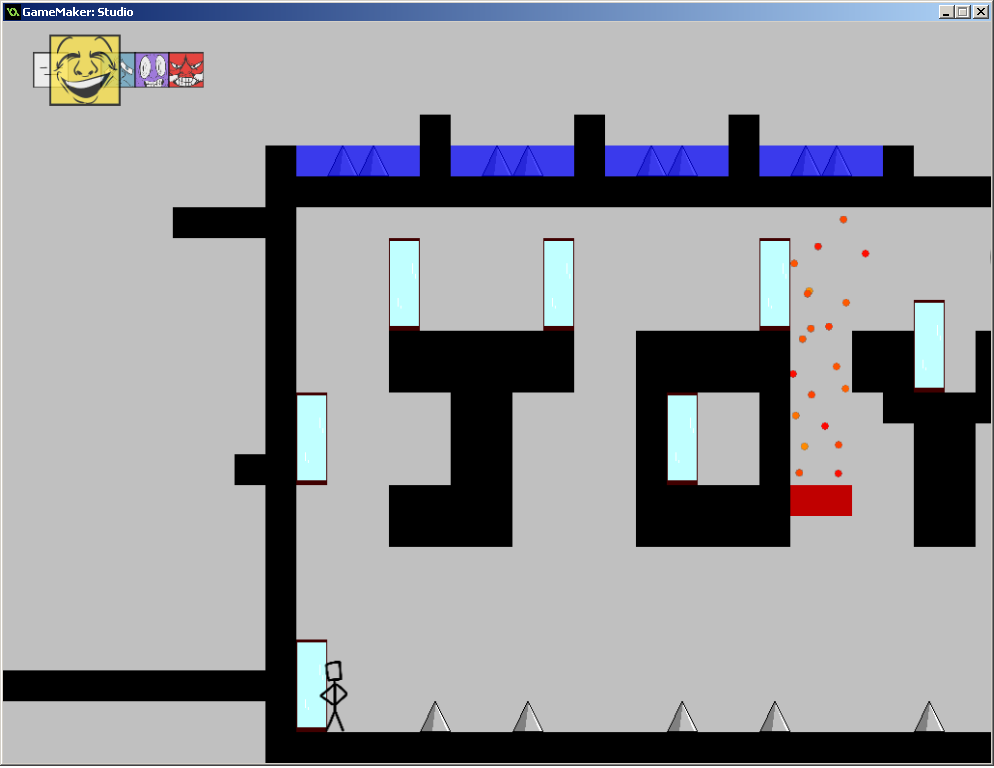
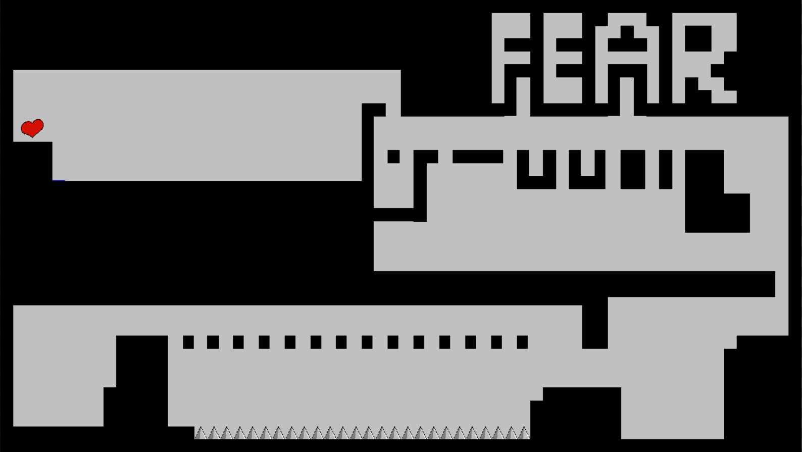
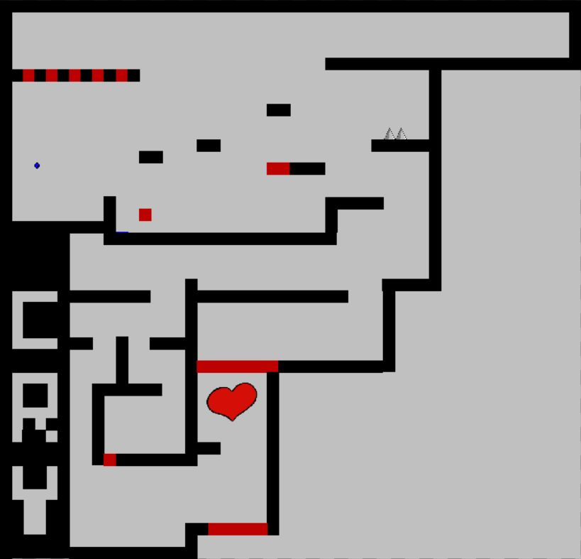
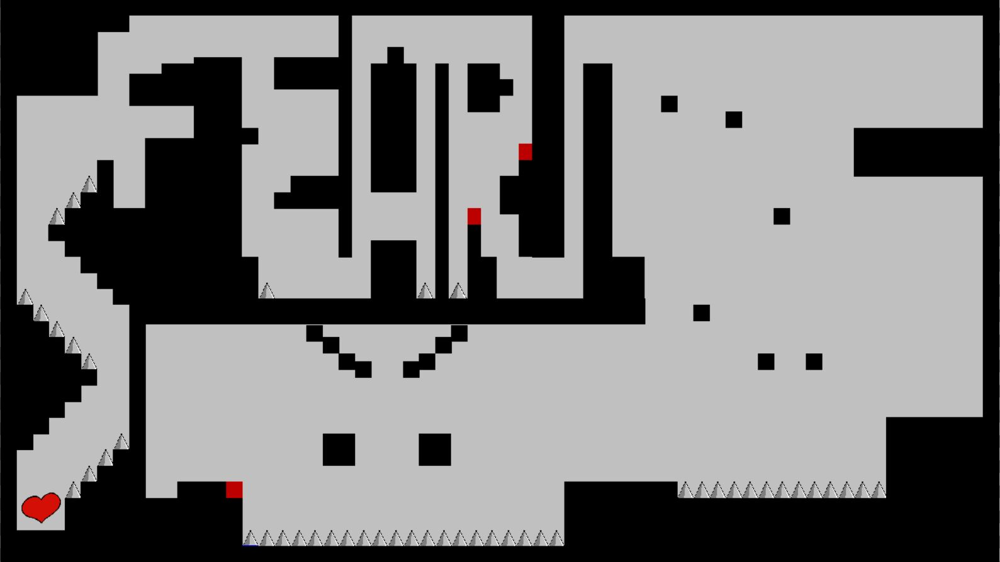
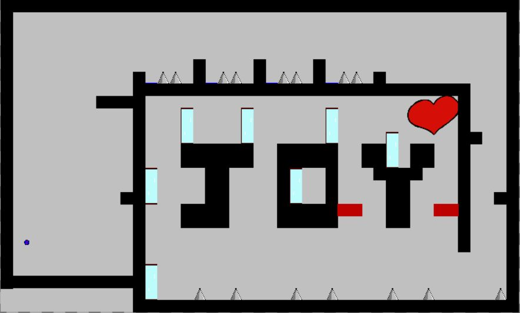

## What Is This?

This is a 2D-platformer game called "Blank" created as our project submission and the first place winner for [Gamecraft 2017](https://itch.io/jam/gamecraft2017) which was a game jam that was held from 8th December 2017 1300 to 9th December 2017 at the National University of Singapore (NUS) School of Computing (SOC). 

## What Is This Game About Then?

As chosen by the organizer of the aforementioned game jam, the overarching theme of the games we ought to create is "Shift". The formulation of games thus have to encapsulate either explicitly or implicitly the literal or the abstract meaning of shifting. Therefore, we chosen to have our game revolve around the concept of shifting emotions.

We called our game "**Blank**" and in "**Blank**", you are a box-headed stickman. Your goal is simple; Make it from point A to point B like any other generic platformer in one piece. The catch here is that you have to conquer obstacles along the way and the only way to do so is via the use of different emotions. 

The game follows the fantasy adventure dreamt by our main character who is sleeping in a hospital bed due to a coma (Refer to title screen above). He embarks upon this journey after having lost all his emotions and soughts to get them back. 

[Introduction Cut Scene](https://github.com/cardboardcode/gamecraft_blank/blob/master/resources/intro.md)

[End Cut Scene]
(https://github.com/cardboardcode/gamecraft_blank/blob/master/resources/end.md)
## Setup

> 1. Take a deep breathe
> 2. Exhale deeply
> 3. Question the purpose of your existence
> 4. Find out that there is no straight answer
> 5. Question why is this list of steps of setup telling you to do something like that.
> 6. Realize that the author of these instructions is trying to waste your time and skip to the next final step.
> 7. Download the BLANK.exe file and double-click.

## Controls

>  **A** & **D** - Move left and right respectively

>  **Shift** - Toggle between different emotions/abilities

>  **SPACEBAR** - Jump   

## Screenshots

## Credits

+ Bey Hao Yun [@cardboardcode](https://github.com/cardboardcode)

+ Yi Zhe [@JohannLee](https://github.com/JohannLee)

+ Daryl Ignatius Tan [@Ditan86](https://github.com/Ditan86)

+ Ying Xian [@lyxian](https://github.com/lyxian)

+ Henry [@HenryJk](https://github.com/HenryJk)
